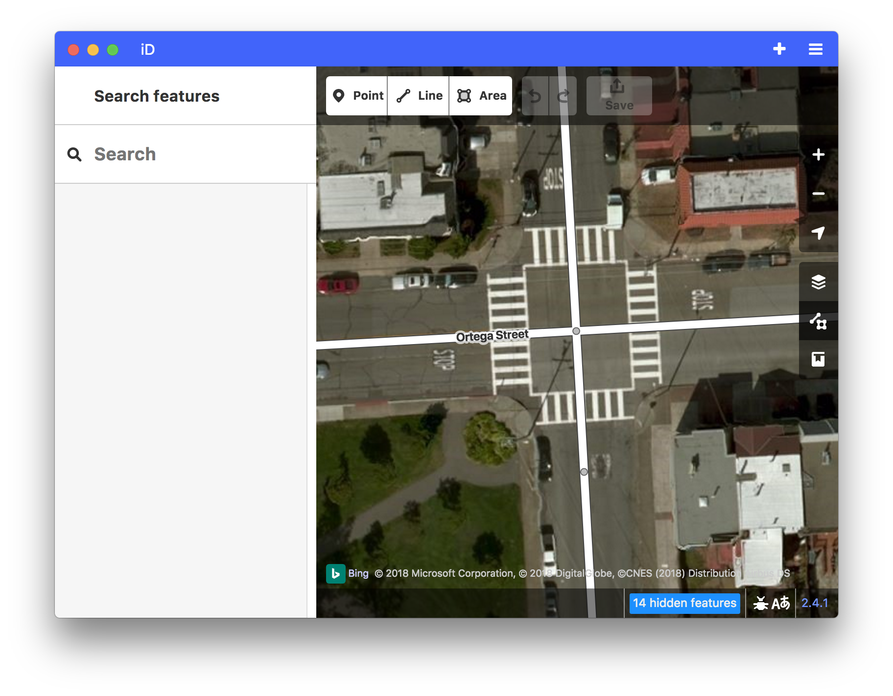
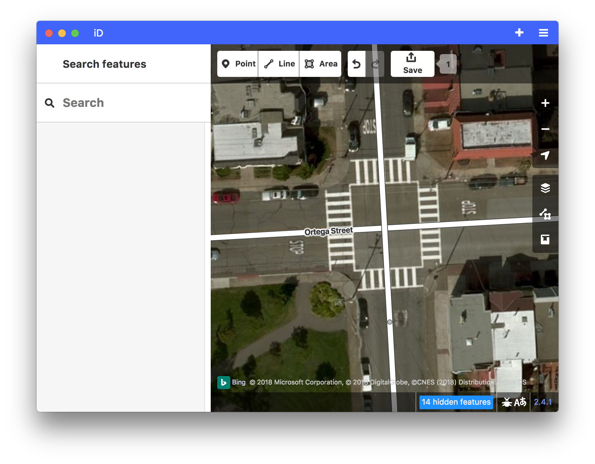
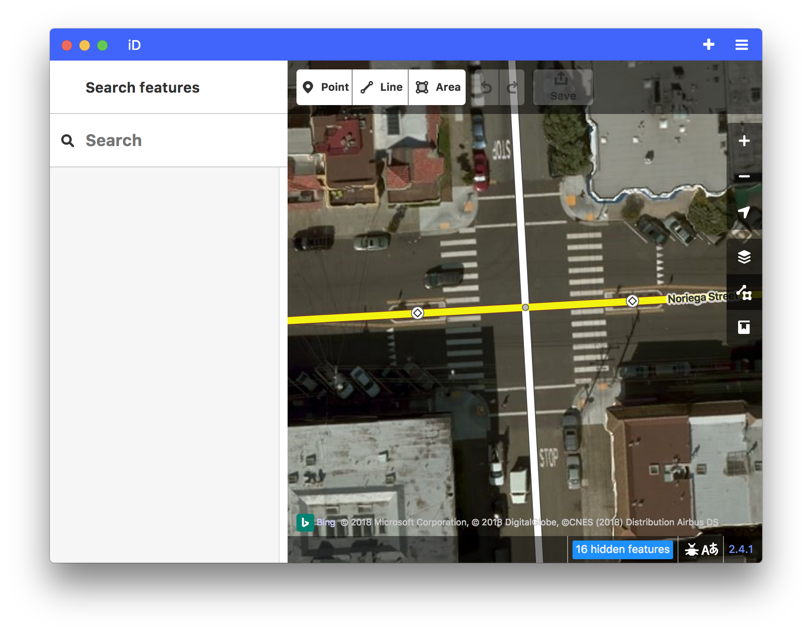
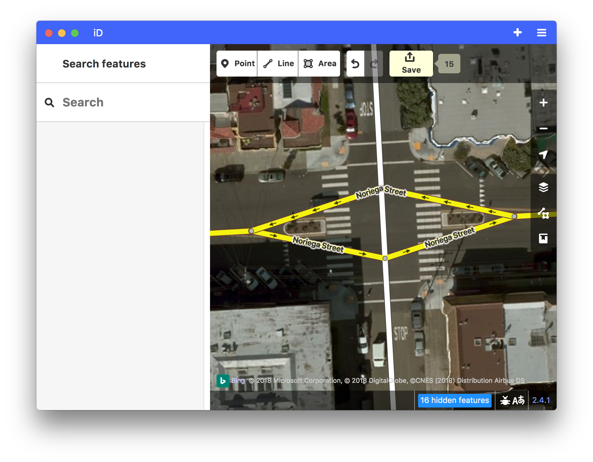
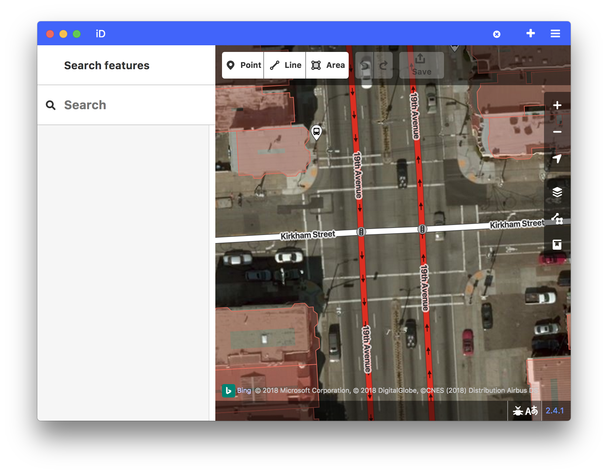
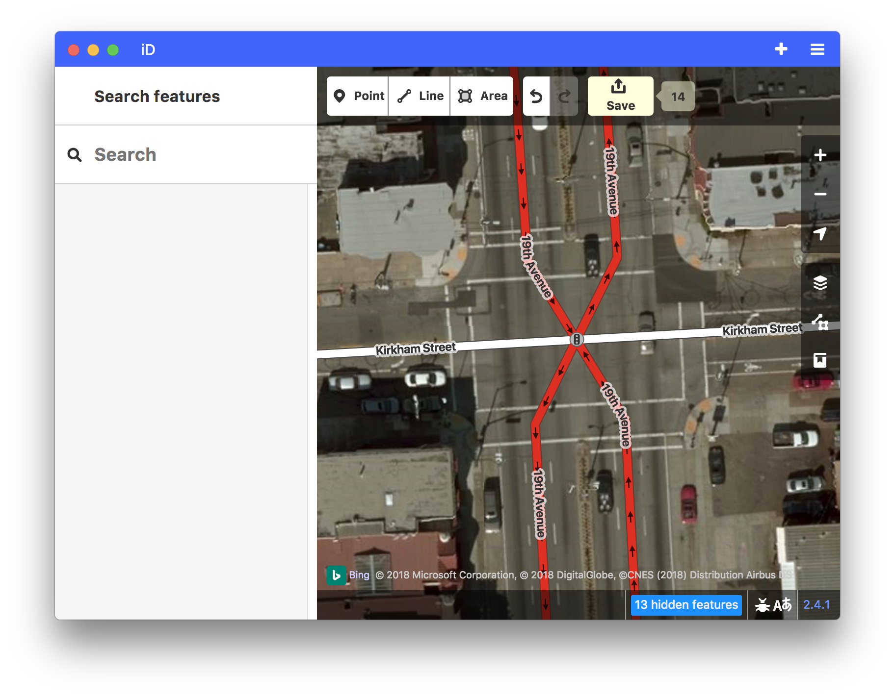
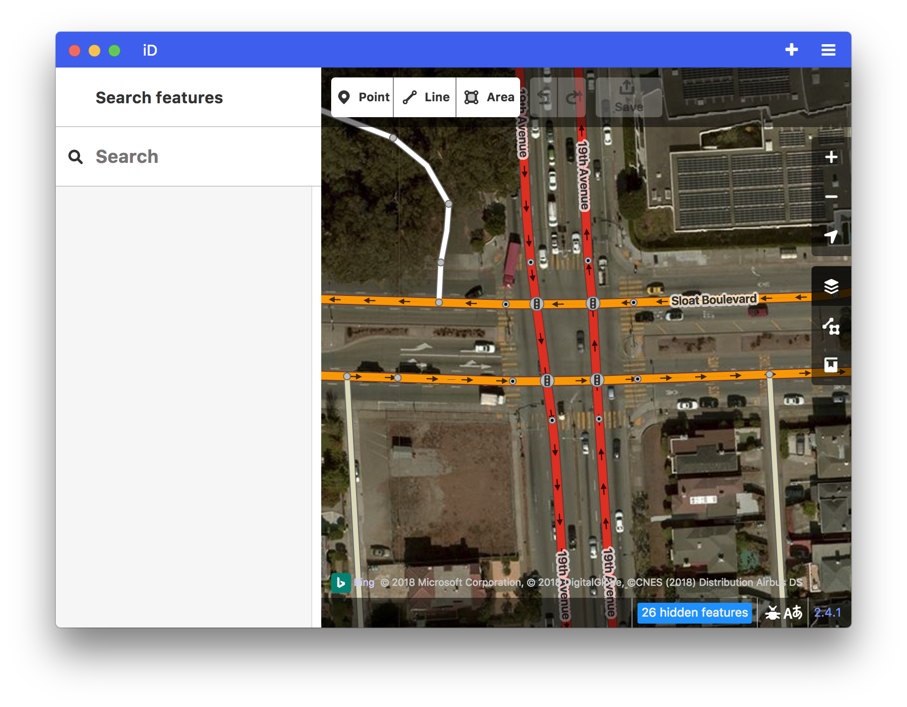
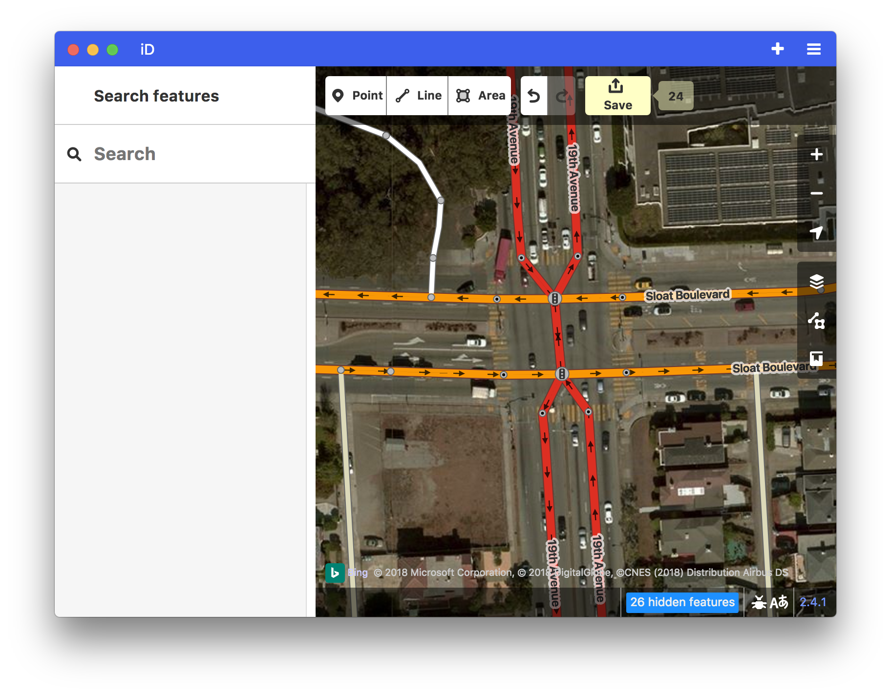

Capturing the various cases of Intersection modelling in OSM and the best practices to follow. The aim of this document is not go into the technicalities of traffic flow in a junction but rather to give a mapper clear cut instructions on how to model different intersections in OSM. Aiming to keep this document simple and easy to follow.

### 1. Intersection of two bi-directional ways

| ✅ | ❌ |
|:---:|:---:|
|  [wireframe view](../../images/intersection-modeling/simpleintersectionwireframe.png) |  [wireframe view](../../images/intersection-modeling/simple_intersection_wireframe_error.png) |

-   This place ☝️ [on the map](https://www.openstreetmap.org/edit#map=20.00/37.75213/-122.48172) 🗺

Each way is a bidirectional road, the movement along which is possible in two directions simultaneously. The point at which the ways intersect denotes the intersection. Crossing ways without a common point make it impossible to build a route between the points that are at the ends of these ways.

### 1a. Intersection and safety islands

| ✅ | ❌ |
|:---:|:---:|
|  [wireframe view](../../images/intersection-modeling/simple_intersection_with_the_safety_islands_wireframe.png) |  [wireframe view](../../images/intersection-modeling/simple_intersection_with_the_safety_islands_wireframe_error.png) |

-   This place ☝️ [on the map](https://www.openstreetmap.org/edit#map=20.00/37.75405/-122.48078) 🗺

In the presence of safety islands, located just before the crossroads, there is no need to divide the road onto dual carriageway. Set the nodes for safety islands and tag them as **`traffic_calming=island`**.

### 2. Intersection of a bidirectional and dual carriageway roads.

| ✅ | ❌ |
|:---:|:---:|
|  [wireframe view](../../images/intersection-modeling/bi-dir_dual_carriageway_intersection_wireframe.png) |  [wireframe view](../../images/intersection-modeling/bi-dir_dual_carriageway_intersection_wireframe_error.png) |

-   This place ☝️ [on the map](https://www.openstreetmap.org/edit#map=20/37.75984/-122.47683) 🗺

No need to squeeze everything into one node bow-tie intersection to have sausage roads.

Some GIS provides bow-tie or sausage roads approach for mapping complex intersections due to system limitations or historical reasons. We don't encourage you to follow this approach. OSRM routing enging supports turn restrictions which have a way as `via`-member of turn restrictions.

### 3. Intersection of dual carriageway roads.

| ✅ |
|:---:|
|  [wireframe view](../../images/intersection-modeling/2x_dual_carriageway_intersection_wireframe.png) |

| ❌ | ❌ |
|:---:|:---:|
|  [wireframe view](../../images/intersection-modeling/2x_dual_carriageway_intersection_wireframe_error.png) |  [wireframe view](../../images/intersection-modeling/2x_dual_carriageway_intersection_wireframe_error_1.png) |

-   This place ☝️ [on the map](https://www.openstreetmap.org/edit#map=19/37.73463/-122.47508) 🗺

Make sure to change any sausage style collapses to a simple intersection type
