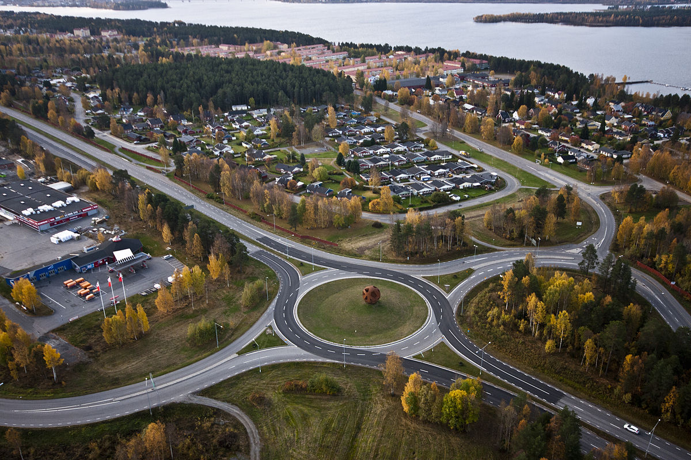
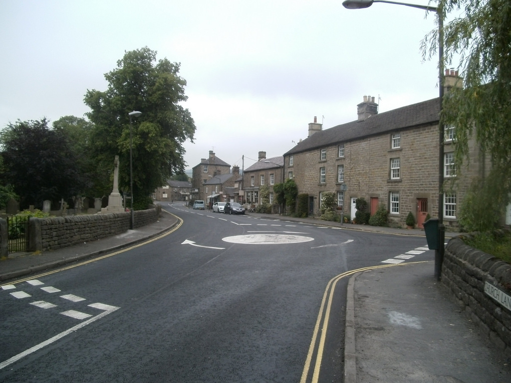
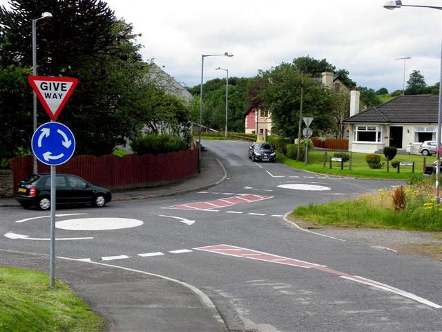
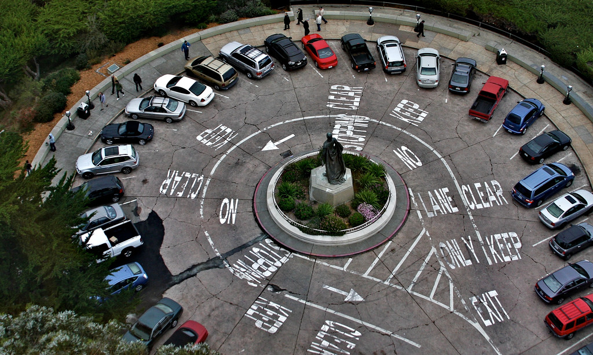

A **roundabout** is a type of circular junction where multiple roads meet and vehicles are directed around an island at the center of the junction in a one-way traffic flow.

Aerial view of [Notviken in Luleå](https://sv.wikipedia.org/wiki/Notviken). Wikipedia

> 💡 Studies by the Federal Highway Administration have found that roundabouts can increase traffic capacity by 30 to 50 percent compared to traditional intersections.

 \*&nbsp;<https://www.wsdot.wa.gov/Safety/roundabouts/BasicFacts.htm>

## Roundabout types

### Mini-roundabout

**Mini-roundabouts**, are smaller than typical roundabouts, have a _right of way_ and a _[traversable](https://wiki.openstreetmap.org/wiki/Traversable)_ center island. The center island can be a painted circle or a low dome but **must be fully traversable** by vehicles. They are also often replaced by stop signs at four-way intersections to slow traffic speeds and reduce accidents in residential neighborhoods that are not designed to accommodate larger vehicles. Vehicles are required to treat the center island as if it were a solid island and drive around it.

_by [Eamon Curry](https://www.flickr.com/photos/eamoncurry/) - <https://flic.kr/p/fpUthJ>_

Mini-roundabouts are sometimes grouped in pairs (a double mini-roundabout) or in "chains", simplifying navigation or otherwise awkward junctions.

_**Double mini-roundabout, Lammy, Omagh**_

_Pictured along Brookmount Road. It is intersected by Tamlaght Road. © Copyright [Kenneth Allen](http://www.geograph.ie/profile/2282) and licensed for [reuse](http://www.geograph.ie/reuse.php?id=3062935) under [Creative Commons Licence](http://creativecommons.org/licenses/by-sa/2.0/)._

> 💡 In the UK – as well as other highway jurisdictions – the maximum size for a mini-roundabout is 28 meters ICD (inscribed circle diameter).

**How to map a mini-roundabout**

[![][72941a36]][72941a36]

_Mini-roundabout in OSM_

  [72941a36]: ../../images/intersection-modeling/roundabouts/roundabout_mapping_mini_roundabout.png "how to map a mini-roundabout"

Select the intersection node and add  **[highway][1108080d]**=**[mini_roundabout][11be223c]** tag. The default direction of a mini-roundabout is counterclockwise 🔄. Please specify the **[direction](https://wiki.openstreetmap.org/wiki/Key:direction)**=**\*** only if the flow of the traffic is in clockwise 🔁 direction.

As the wiki suggests, we mark mini-roundabouts at the place of the traversable center point. In the case of roundabouts with a traffic island in the center, if there is a _roundabout_ sign, tag it with **junction**=**roundabout** and **traffic_calming**=**island** tags on the node of the intersection, otherwise put only **traffic_calming**=**island** tag.

![][7c512a18]

_Small roundabout with traffic island by **[Elaine Nelson](https://www.flickr.com/photos/epersonae/)** - <https://flic.kr/p/8n4kXv>_

  [7c512a18]: ../../images/intersection-modeling/roundabouts/roundabout_small.jpg "small roundabout"

Mini-roundabouts are always have to be represented by a **node**. Alternatively, one can draw the roundabout as a circular line in the direction of traffic flow and tag it with  **highway=residential\|unclassified**, **oneway**=**yes** and **junction**=**roundabout** tags.

**Common Misconceptions**

What is not a mini-roundabout?

-   Traffic calming island in the center of a junction – **[traffic_calming](https://wiki.openstreetmap.org/wiki/Key:traffic_calming)**=**[island](https://wiki.openstreetmap.org/wiki/Tag:traffic_calming%3Disland)**
-   Turning circle – this is a circular feature with a traversable center point, which allows vehicles to turn around –  **[highway][1108080d]**=**[turning_circle][496a5a09]**
-   Turning loop – this has the same function as a turning circle but with non-traversable center point –  **[highway][1108080d]**=**[turning_loop][e1236adf]**
-   Smaller roundabout, but not a mini-roundabout. Treat it the same as a large roundabout, and for consistency put  **[junction][f14df547]**=**[roundabout][bca8053e]** tag on the node of the junction.

[1108080d]: https://wiki.openstreetmap.org/wiki/Key:highway

[e1236adf]: https://wiki.openstreetmap.org/wiki/Tag:highway%3Dturning_loop

[496a5a09]: https://wiki.openstreetmap.org/wiki/Tag:highway%3Dturning_circle

[bca8053e]: https://wiki.openstreetmap.org/wiki/Tag:junction%3Droundabout

[f14df547]: https://wiki.openstreetmap.org/wiki/Key:junction

See examples of mini-roundabouts in the [OpenStreetMap Wiki](https://wiki.openstreetmap.org/wiki/Tag:highway%3Dmini_roundabout#Mini-roundabouts).

### Roundabout

A [roundabout](https://en.wikipedia.org/wiki/Roundabout) is a generally circular road [junction](https://wiki.openstreetmap.org/wiki/Junctions) where the traffic inside circle has right of way. These are tagged with **[junction][f14df547]**=**[roundabout](https://wiki.openstreetmap.org/wiki/Tag:junction%3Droundabout)** tag. This tag is only used for road intersections where traffic in the roundabout has right of way in the absence of a traffic signal.

[![roundabout][108eb915]][108eb915]
_Take a look at the [wireframe view][c134f465] of this roundabout_

  [108eb915]: ../../images/intersection-modeling/roundabouts/roundabout.png "roundabout"
  [c134f465]: ../../images/intersection-modeling/roundabouts/roundabout_wireframe.png "wireframe view"

**How to map a roundabout**

To indicate a roundabout — draw a closed line in the direction of the traffic flow, which aligns to satellite imagery just as one would while tracing a road. Tag the line with **[junction][f14df547]**=**[roundabout](https://wiki.openstreetmap.org/wiki/Tag:junction%3Droundabout)**  tag and the appropriate **highway**=**\*** tag.

Roundabouts are implied to be one-way roads, but you may specify this explicitly by adding **[oneway](https://wiki.openstreetmap.org/wiki/Key:oneway)**=**[yes](https://wiki.openstreetmap.org/wiki/Tag:oneway%3Dyes)** tag. Additionally the number of **[lanes](https://wiki.openstreetmap.org/wiki/Key:lanes)**=**\*** in the circle (_typically 2, where long vehicles will need to use both_) can also be tagged.

Connect all the highways which meets the roundabout based on traffic flows. If a dual carriageway shares traffic with the roundabout, connect each its direction (one arriving, one departing) separately to the respective exit and entrance nodes on the roundabout. Don’t use the same node as entrance to and exit from a roundabout. Each road has to be connected with the roundabout in a separate node.

When two roads share the same exit/entrance node connect them before the roundabout and not at the roundabout.

[![][8c17feb2]][8c17feb2]

  [8c17feb2]: ../../images/intersection-modeling/roundabouts/roundabout_pinch_ways.png

**Roundabout shapes**

Roundabouts are not necessarily circular in shape: there are roundabouts that are oval-shaped or D-shaped (with a straight segment – often created on a square whose one side is along an avenue).

[![][c4d4f134]][c4d4f134]

  [c4d4f134]: ../../images/intersection-modeling/roundabouts/roundabout_o_shape.png "O-shaped roundabout"

See examples of roundabouts in the [OpenStreetMap Wiki](https://wiki.openstreetmap.org/wiki/Tag:junction%3Droundabout#Roundabouts).

### Traffic circle

A **traffic circle** is a type of intersection that directs both turning and through traffic onto a [one-way circular roadway](https://www.openstreetmap.org/user/daniel-j-h/diary/40101). Contrary to a roundabout, where entering traffic always yields to traffic already in the circle and merges in directly, the entrances to traffic circles are three-way intersections often controlled either by stop signs or traffic signals, but not in all cases.

![][bceeea1b]

  [bceeea1b]: ../../images/intersection-modeling/roundabouts/roundabout_traffic_circle.png "Traffic circle"

The size of circular junctions can vary from small to very large with several lanes. However, generally **<u> the circular junction should not contain a road network within itself</u>**. This means circular ring roads around a city are not circular junctions. To designate a circular junction use **[junction][f14df547]**=**[circular][d11d94d4]** tag.

  [d11d94d4]: https://wiki.openstreetmap.org/wiki/Tag:junction%3Dcircular

**How to map a circular junction**

To add a circular junction, use the same approach as you would for [drawing a roundabout](#how-to-map-roundabout). Draw a circle line and tag it according to the roadclass of connected roads. Mark all nodes that correspond to traffic lights or traffic signs that control traffic flow within the roundabout.

If a traffic circle or roundabout is bisected by further roads that use different parts of the circle, you may split the closed line into segments with similar tagging and add each segment to its respective route relation.

[![][8d6d5862]][8d6d5862]
_The Place Charles de Gaulle is the meeting point of twelve straight avenues, creating a large road junction in Paris, France._

  [8d6d5862]: ../../images/intersection-modeling/roundabouts/roundabout_traffic_circle_paris.png "Place Charles de Gaulle."

## Junctions that are not rounabouts

### Hamburger roundabout/throughabout/cut-through

In spite of their name, [Hamburger roundabouts](https://wiki.openstreetmap.org/wiki/Hamburger_roundabout), also known as [throughabout or cut-through](http://en.wikipedia.org/wiki/Roundabout#Hamburger_roundabout), are not roundabouts. In this situation the tag **[junction][f14df547]**=**[roundabout](https://wiki.openstreetmap.org/wiki/Tag:junction%3Droundabout)** has to be avoided..

|[![][2ff2d8eb]][2ff2d8eb]|[![][b421c5e4]][b421c5e4]|
|---|---|
|_A throughabout divided by double carriageway_|_A throughabout divided by bi-directional way_|

  [2ff2d8eb]: ../../images/intersection-modeling/roundabouts/roundabout_throughabout_kyiv.png
  [b421c5e4]: ../../images/intersection-modeling/roundabouts/roundabout_throughabout.png

### Turning circle

A Turning circle is a circular feature with a traversable center point, which allows vehicles to turn around – **[highway][1108080d]**=**[turning_circle][496a5a09]**

[![][86003e49]][86003e49]

  [86003e49]: ../../images/intersection-modeling/roundabouts/roundabout_turning_circle.png

### Turning loop

A turning loop is similar to a turning circle but with a non-traversable center point.

_Turning loop by [Tony Webster](https://www.flickr.com/photos/diversey/), <https://flic.kr/p/4aZCFB>_

The tag **[highway][1108080d]**=**[turning_loop][e1236adf]** is used for a node to indicate a widened area of a highway with a non-traversable island for turning around. These loops are often circular and located at the end of a road.

|[![][aaf28646]][aaf28646]|[![][41dbfb48]][41dbfb48]|
|---|---|
|_node with **highway**=**turning_loop** tag_|_circular way with **highway**=**residential**_|

  [41dbfb48]: ../../images/intersection-modeling/roundabouts/roundabout_turning_loop_circle.png

  [aaf28646]: ../../images/intersection-modeling/roundabouts/roundabout_turning_loop_node.png

### "Magic" roundabouts or ring junctions

"Magic roundabouts" direct traffic in both directions around the central island. In order to connect the inner and outer ring with the adjacent roads, small roundabouts or mini-roundabouts are used. Drivers on mini-roundabouts have the right of way, unlike those who are on the inner or outer ring of the magic roundabout. Each nodal element of such a structure, represented by a roundabout, can be considered as an independent intersection that is connected to the rest of the intersections (roundabouts) via link roads.

|[![][834623ed]][834623ed]|[![][bbc5e25f]][bbc5e25f]|
|---|---|
|_The [Swindon Magic Roundabout](https://en.wikipedia.org/wiki/Magic&#95;Roundabout&#95;&#40;Swindon&#41;)_|_The **Greenstead roundabout** in [Colchester, Essex](https://en.wikipedia.org/wiki/Colchester)._|

[![][8c1b9238]][8c1b9238]
_[Denham Roundabout](https://en.wikipedia.org/wiki/Denham_Roundabout)_

  [834623ed]: ../../images/intersection-modeling/roundabouts/roundabout_magic_swindon.png
  [bbc5e25f]: ../../images/intersection-modeling/roundabouts/roundabout_magic__colchester.png

  [8c1b9238]: ../../images/intersection-modeling/roundabouts/roundabout_magic_swindon_denham.png

## See also

-   [Wikipedia article about roundabouts](http://en.wikipedia.org/wiki/Roundabout)
-   [UK Highways Agency Design Manual for Roads and Bridges](http://www.standardsforhighways.co.uk/dmrb/vol6/section2/td1607.pdf) – Volume 6, Section 2, Part 3: Geometric Design of Roundabouts
-   [US Federal Highway Administration Safety Program - Technical Summary](http://safety.fhwa.dot.gov/intersection/roundabouts/fhwasa10006/) – Roundabouts
-   Wiki OpenStreetMap
    -   Mini-roundabouts (**[highway][1108080d]**=**[mini_roundabout][11be223c]**)
    -   Roundabouts (**[junction][f14df547]**=**[roundabout][bca8053e]**)
    -   Rotaries and traffic-circles (**[junction][f14df547]**=**[circular][d11d94d4]**)
    -   Turning circles (**[highway][1108080d]**=**[turning_circle][496a5a09]**)
    -   Turning loops (**[highway][1108080d]**=**[turning_loop][e1236adf]**)

[11be223c]: https://wiki.openstreetmap.org/wiki/Tag:highway%3Dmini_roundabout
